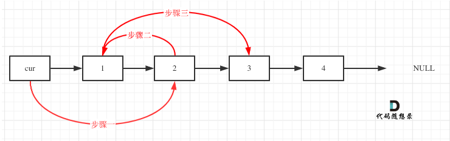

I finish the question by watching https://www.bilibili.com/video/BV1YT411g7br/

need to do this again!!

the process are as follows:
>+ (1) define a dummynode, and use a ListNode named cur, we init cur=dummynode
>+ (2) we need to change cur.next and cur.next.next, before swap them, we need to identify whether they are exists
>+ (3) do the following process 
>+ for 1 and 3, use var temp to store them