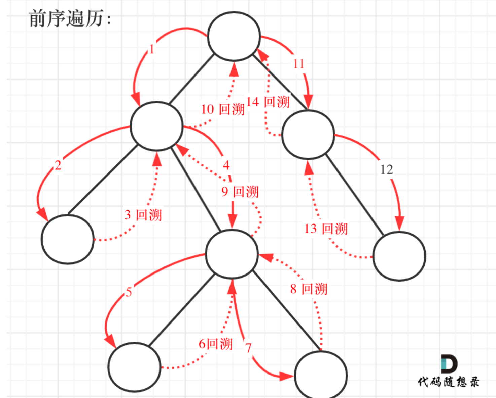

# tree questions, use backtrace and recursion

<font color='red'>can do this qustions again and recite it!!! or just do 112 </font>

done this question by read <https://programmercarl.com/0257.%E4%BA%8C%E5%8F%89%E6%A0%91%E7%9A%84%E6%89%80%E6%9C%89%E8%B7%AF%E5%BE%84.html#%E7%AE%97%E6%B3%95%E5%85%AC%E5%BC%80%E8%AF%BE>

**the process are as follows:**


>+ first traverse the mid node, and then left node, then right node. 
>+ If it is a leaf, add the node to path and add the path to result. 
>+ If not, recursion the left child and pop it; right child and pop it.

**something need to pay attation:**
transfer [1,2,5] to "1->2->5", the map(str, array) function converts each integer in the array into a string, and then the join() method concatenates them using "->" as the delimiter.

```python
array = [1, 2, 5]
string_representation = "->".join(map(str, array))
print(string_representation)
```
