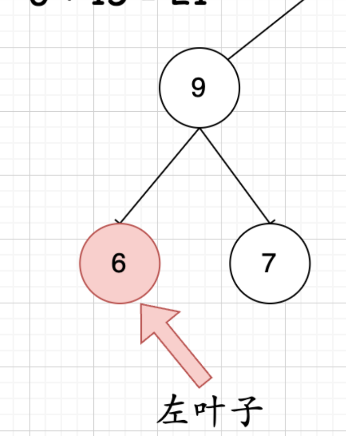

# binary tree question

the process are as follows:
(1) make sure the parimaters and return value (don't need to add)
(2) termination conditions: if the node is None or is a leaf node
(3) logic of recursion:
{width=200}
for the node, the recursion logic is get its left-child value (if the child is a leaf node), recurse the left subtree and right subtree.