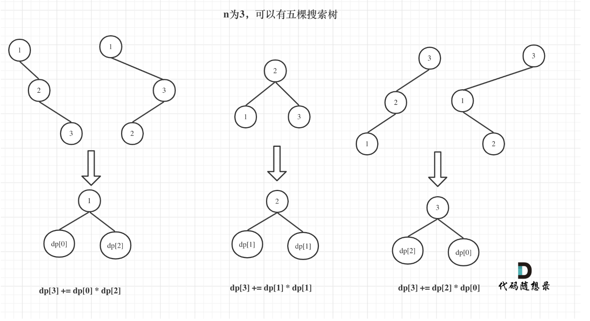

# first time

<font color='red'>need to do it again!!!</font>

the process are as follows:
1. 确定dp数组：由1到i个节点组成的二叉树

2. 确定递推公式：

所以对于dp[i],它的递推公式如下;
```python
for t in range(1,t+1):
    dp[i]=dp[i]+dp[t-1]*dp[i-t]
```

3. 初始化
只用初始化dp[0],因为后面都是乘法，所以dp[0]=1

4. 遍历顺序从前到后

